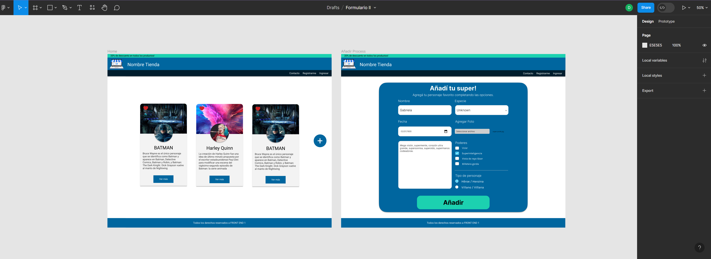
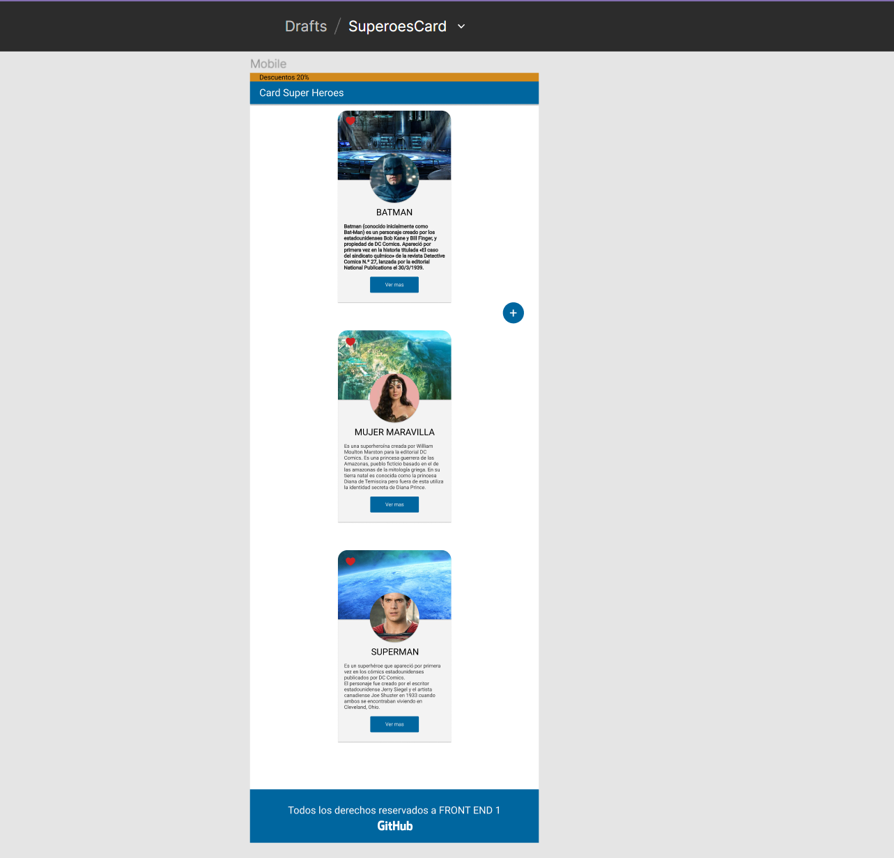
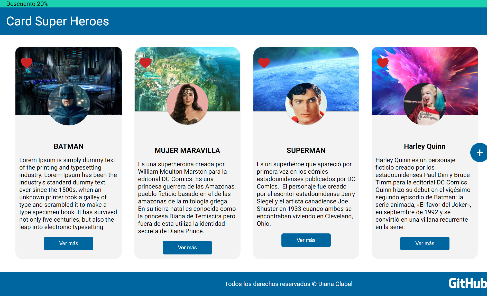
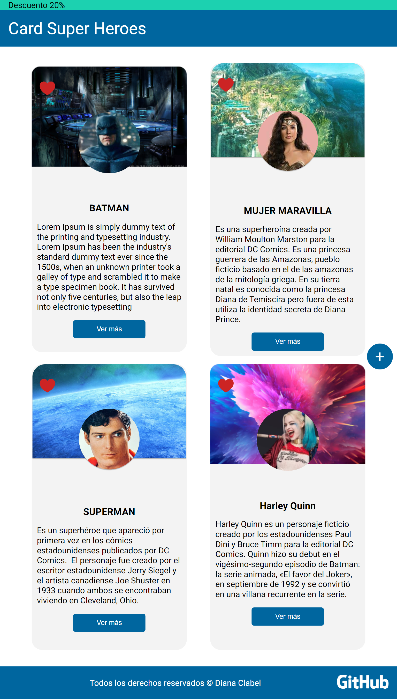
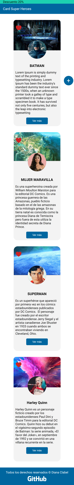

# Desafío card Super Heroes

## 1. Descripción

Este proyecto tiene como objetivo la creación de una emocionante página web dedicada a los icónicos superhéroes del universo DC Comics. Los aficionados podrán explorar una variedad de héroes legendarios y, lo que es aún mejor, podrán agregar a su superhéroe favorito. Para hacer esto posible, hemos recibido un diseño detallado en Figma que servirá como nuestra guía principal durante el desarrollo.

## 2.Características Clave

Exploración de Superhéroes: Los visitantes podrán navegar y explorar una lista de superhéroes de DC Comics. Cada superhéroe estará acompañado de información detallada, como su nombre y historia de fondo.

Agregar a tu Colección: Los usuarios tendrán la opción de agregar a su superhéroe favorito. Esto permitirá a los fanáticos llevar un registro de sus personajes preferidos en un solo lugar.

Diseño Figma: Utilizaremos el diseño proporcionado en Figma como una guía sólida para la apariencia y la estructura de la página web. Esto garantizará que la página sea visualmente atractiva y coherente con la visión origina

## 3.Prototipo de alta fidelidad

Se ha proporcionado un prototipo de alta fidelidad que incluye capturas de pantalla de cómo se espera que se vea la página web tanto en escritorio como en dispositivos móviles y tablets.

Para lograrlo, hemos seguido estos pasos clave:

- Crear la estructura básica y semántica de HTML.
- Medidas relativas en fuentes y elementos estructurales de HTML.
- Implementar flexbox para el layout.
- Utilizar dos media queries con viewport para tablet y celular.

## 4. Resultado

### Desktop

### Mobile y Tablet

